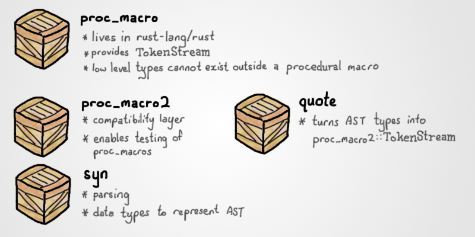

##  Proc Macro Rules!

Azriel Hoh

---

### Agenda

* Why macros?
* Re-look at `macro_rules!`.
* Procedural macros: What and why.
* Live demos.
    - Function Like.
    - Derive Macros.
    - Attribute Macros.
* Learnings
* Informative

---

### Macros

+++

### Macros

Why would you use macros?

* Increase ergonomics.
* Reduce duplication.
* Reduce boilerplate.

+++

### Macros: Increase Ergonomics

[](https://play.rust-lang.org/?version=stable&mode=debug&edition=2018&gist=54baea61f79020af41e8d5843124ac53) `impl Trait for Type` to `#[derive(Trait)]` [](https://play.rust-lang.org/?version=stable&mode=debug&edition=2018&gist=550bab87af4a4d91cc5eebd0d06373cb)

+++

### Macros: Reduce Duplication

[](https://play.rust-lang.org/?version=stable&mode=debug&edition=2018&gist=3533ef5f21cc9156417c089f7cc3d04f) De-duplicating similar implementations [](https://play.rust-lang.org/?version=stable&mode=debug&edition=2018&gist=2da6a5967cff11579db5f4034126144c)

+++

### Macros: Reduce Boilerplate

[🚀](https://github.com/SergioBenitez/Rocket/blob/v0.4.0/core/codegen/src/lib.rs#L309-L317) Rocket web framework:

```rust
#![feature(proc_macro_hygiene, decl_macro)]

#[get("/<name>/<age>")]
fn hello(name: String, age: u8) -> String {
    format!("Hello, {} year old named {}!", age, name)
}

fn main() {
    rocket::ignite().mount("/hello", routes![hello]).launch();
}
```

---

### `macro_rules!`

+++

### `macro_rules!`

Refresher [](https://play.rust-lang.org/?version=stable&mode=debug&edition=2018&gist=6b314ca35a74c443dc8cd181bf01bac0):

```rust
macro_rules! hello {
    // Match a pattern, output tokens
    () => { println!("Hello") };
}

fn main() {
    hello!();
    hello![];
    hello! {};

    println! {
        "{}{}{}{} {}{}",
        "\u{69}", "\u{74}", "\u{27}",
        "\u{73}", "\u{6d}", "\u{65}",
    };
}
```

+++

### `macro_rules!`

`macro_rules!` is happy to take any token tree [](https://play.rust-lang.org/?version=stable&mode=debug&edition=2018&gist=c66e5c876886a2ef19655181cef37d2d):

```rust
macro_rules! java {
    (static void $name:ident($($_:tt)+) { $($body:tt)+ }) => {
        fn $name() { java!($($body)+); }
    };

    ($_:ident.$__:ident.$fn_name:ident($args:tt);) => {
        println!($args);
    };
}

java! {
    static void main(String[] args) {
        System.out.println("jRust!");
    }
}
```

+++

### `macro_rules!`

* Items are captured as *whole*s, and cannot be broken down within the macro body.
* Very unintuitive failures and errors.
* Can be very difficult to troubleshoot.

```rust
macro_rules! java {
    (static void $name:ident($($_:tt)+) $body:block) => {
        fn $name() { java!($body); }
                        // ^^^^^ no rules expected this token in macro call
    };

    ({ $_:ident.$__:ident.$fn_name:ident($args:tt); }) => {
        println!($args);
    };
}
```

[](https://play.rust-lang.org/?version=stable&mode=debug&edition=2018&gist=f86e0451be3a7545af6875ce46530571)

---

### Proc Macros

+++

### What Are Proc Macros?

* Macros defined with procedural code.
* Tokens are parsed into an AST, and code can reason over that generate output tokens.
* Not hygienic by default.

```
Tokens   --[parse]-->   AST   --[logic]-->   Tokens
```

+++

### What Are Proc Macros?

```rust
// Any of:
function_like!("Looks just like `macro_rules!`");
function_like! {
    "Looks just like `macro_rules!`"
}

#[derive(CustomDerive)]
struct Hello;

#[custom_attribute]
fn do_something() {}
```

+++

### Why Proc Macros?

For users:

* 🎨 Better error messages.
* 📝 Nicer syntax.

+++

### Why Proc Macros?

For developers:

* 🌲 Parsing AST instead of matching patterns.
* 🔺 Can write procedural logic.
* 🦀 Better diagnostics.
* 💯 Easier to test.
* 📦 Dedicated crate *(not a selling point)*.

---

### Function Like

+++

### Function Like

Look like this:

```rust
function_like!("args");
function_like!["args", "more args"];
function_like! {
    struct Struct {}
}
```

+++

### Function Like

1. Takes in any well-formed tokens.
2. Outputs replacement tokens.

+++

### Function Like

**Demo:** see `function_like` crate in repository.

1. Parsing.
2. Errors.
3. Traversing.

---

### Derive Macros

+++

### Derive Macros

Look like this:

```rust
#[derive(CustomDerive)]
struct Struct;

// and even
#[derive(a_crate::CustomDerive)]
struct Struct;
```

+++

### Derive Macros

1. Attached to a struct / enum.
2. Generates *additional* tokens.
3. Can have *helper* attributes.
4. **Cannot** see derive meta item.

+++

### Derive Macros

Given the following:

```rust
/// Documentation for a struct.
#[derive(Clone, CustomDerive, SomeoneElsesDerive, Debug)]
#[custom_derive_helper_1]
#[someone_elses_attr]
pub struct Struct {
    #[custom_derive_helper_2(value = "Something")]
    pub field: Type,
}
```

+++

### Derive Macros

Your macro will see:

```rust
// Missing: #[derive(Clone, CustomDerive, SomeoneElsesDerive, Debug)]

#[doc = "Documentation for a struct."]
#[someone_elses_attr]
#[custom_derive_helper_1]
pub struct Struct {
    #[custom_derive_helper_2(value = "Something")]
    pub field: Type,
}
```

+++

### Derive Macros

What you can do:

* Generate `impl` blocks -- normal / trait impls.
* Generate more `type`s -- `struct`s and `enum`s.

What you **can't** do:

* Mutate the `type`, e.g. add fields, documentation.

+++

### Derive Macros

**Demo:** see `derive_mode` crate in repository.

1. Parsing.
2. Erring.
3. `quote`: Variables must be single layer.
4. `cargo expand`

---

### Attribute Macros

+++

### Attribute Macros

1. See everything about an *item*.
2. Takes in tokens, and outputs *replacement* tokens.

+++

### Attribute Macros

[🚀](https://github.com/SergioBenitez/Rocket/blob/v0.4.0/core/codegen/src/lib.rs#L309-L317) Rocket web framework

```rust
#[get("/<name>/<age>")]
fn hello(name: String, age: u8) -> String {
    format!("Hello, {} year old named {}!", age, name)
}

fn main() {
    rocket::ignite().mount("/hello", routes![hello]).launch();
}
```

+++

### Attribute Macros

```rust
// Derives the following traits:
//
// * `Clone`
// * `Copy`
// * `Deref`
// * `DerefMut`
// * `derive_more::Add`
// * `derive_more::AddAssign`
// * `derive_more::Display`
// * `derive_more::From`
// * `derive_more::Sub`
// * `derive_more::SubAssign`
#[numeric_newtype]
pub struct HealthPoints(pub u32);
```

+++

### Attribute Macros

**Demo:** see `attribute` crate in repository.

---

### Proc Macros: How

+++

### Proc Macros: How

How to get started:

* @size[0.7em](Blog: https://blog.rust-lang.org/2018/12/21/Procedural-Macros-in-Rust-2018.html)
* @size[0.7em](Reference: https://doc.rust-lang.org/reference/procedural-macros.html)

+++

### Proc Macros: How

Crates you will encounter:

* `syn`
* `quote`
* `proc_macro`
* `proc_macro2`

+++

### Proc Macros: How



+++

### Proc Macros: How

If you need help:

* Community Discord server: https://bit.ly/rust-community `#macros` channel

---

### Learnings

+++

### Learnings

Use qualified type names when referring to a type/trait that is likely to be overloaded, and the module path is *known*:

* `std`: avoids name collisions.
* **re-exported crate:** consumers do not have to depend on transitive dependencies.

This avoids ambiguity such as `Result<T, E>` vs `io::Result<T>`:

```rust
#[derive(Imaginary)]
pub struct Config;

/// derive Imaginary implementation
let token_stream2 = quote! {
    impl #name {
        // do:
        pub fn imagine(&self) -> std::result::Result<Self, String> {
            unimplemented!()
        }

        // don't:
        // Fails if there is a `use crate::Result;` in scope.
        pub fn imagine(&self) -> Result<Self, String> {
            unimplemented!()
        }
    }
};
```

+++

### Learnings

Using non-qualified names means consumers have to `use dep::Type`, but it means the macro is friendlier if dep is re-exported:

```rust
// Your crate
pub use specs as ecs;

// Consumer
#[derive(Component)]
pub struct Position(f32, f32, f32);
```

+++

### Learnings

Prefix attributes with crate name to avoid collision:

```rust
use serde::Serialize;
use structopt::StructOpt;
use strum_macros::EnumString;

#[derive(EnumString, Serialize, StructOpt)]
#[serde(rename_all = "snake_case")]
#[strum(serialize_all = "snake_case")]
#[structopt(rename_all = "snake_case")]
pub enum SubCommands {
    Add,
    Remove,
}
```

+++

### Learnings

* `cargo expand` helps a lot!
* Unless you output non-well-formed tokens.

---

### Informative

+++

### Informative

What you can't do:

* *Parse* `Path`s in attributes:

    ```rust
    // Can write, cannot parse with `syn` 0.15
    #[derive(derive_more::Add)]
    pub struct HealthPoints(pub u32);
    ```

* Output warnings with span information.

+++

### Informative

|               | Derive    | Function      | Attribute   |
| ------------- | --------- | ------------- | ----------- |
| Stable since  | 1.15      | 1.30          | 1.30        |
| Mutates input | ❌ No    | ✔️ Yes        | ✔️ Yes     |
| Applies to    | 💠 types | 🔵 any tokens | ⚪ any item |

---

### Links

* @size[0.7em](Slides: https://github.com/azriel91/proc_macro_rules)
* @size[0.7em](Blog: https://blog.rust-lang.org/2018/12/21/Procedural-Macros-in-Rust-2018.html)
* @size[0.7em](Reference: https://doc.rust-lang.org/reference/procedural-macros.html)
* @size[0.7em](syn: https://github.com/dtolnay/syn)
* @size[0.7em](proc-macro2: https://github.com/alexcrichton/proc-macro2)
* @size[0.7em](quote: https://github.com/dtolnay/quote)
* @size[0.7em](macro_rules!: https://danielkeep.github.io/tlborm/book/mbe-macro-rules.html)

---

### Questions, Answers and Comments
